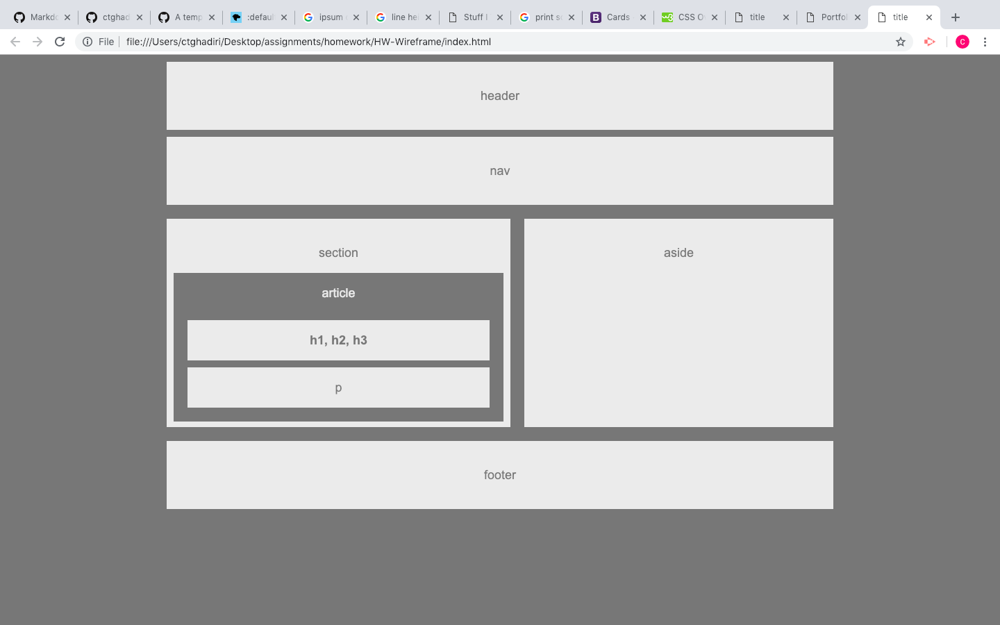

# HW-Wireframe

### First Homework Assignment

* Technology used
    - HTML
    - CSS
* CSS Tools
    - Positioning   
        * Padding
        * Margins
        * Float
        * Clear
        * Text-Align

### Link to Deployed Page

https://ctghadiri.github.io/HW-Wireframe/

### Picture of Final Product

### Learning Points
* The box model was a huge help in understanding how everything interacted with each other
* Small changes on one object can create a huge impact on others
* It is better to work from the outside in

### Author

## Cyrus Ghadiri

### Acknowledgments

* UC BERKELEY BOOTCAMP TEAM
* www.w3schools.com
